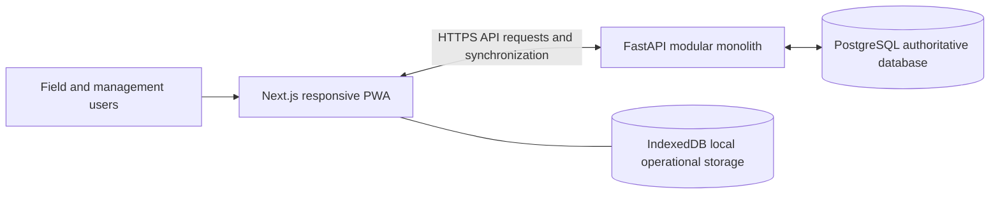

# Architecture overview

## System boundary

Koranco will comprise one browser-based frontend, one backend API, and one PostgreSQL database. External identity, email, storage, monitoring, or hosting services are not selected. Integration boundaries will be documented only when a confirmed requirement introduces them.

The PWA will provide field and management experiences from one frontend codebase. IndexedDB/Dexie will be introduced for explicitly approved offline workflows; it is not an alternative system of record.

The FastAPI backend is the security and business-rule boundary. It validates requests, authorizes operations, coordinates domain logic and transactions, records relevant audit history, and exposes deliberate API contracts. PostgreSQL is authoritative.

The foundation exposes versioned operational endpoints under `/api/v1`, including lightweight health and database-backed readiness checks. These endpoints carry no farm data. Development CORS is explicit, API documentation is disabled in production, and backend requests receive a validated correlation identifier for operational logs.

## Request and data flow

For connected operations, the frontend sends an authenticated request to the API. The API validates and authorizes it, executes confirmed domain rules within an appropriate transaction, persists the result, and returns an explicit response.

For approved offline operations, the PWA first persists the operation locally and later submits it safely. The API remains responsible for authorization, idempotency, validation, and durable acceptance. Detailed synchronization behavior remains intentionally undecided until workflows are understood.

## Why a modular monolith

The initial domains share authorization, transactions, reporting needs, and operational data. A modular monolith provides clear code boundaries without the deployment, distributed-transaction, observability, and support costs of microservices. One system is more appropriate for the expected team and maturity of the product.

Module boundaries should remain explicit so responsibilities can evolve. A service may be separated later only when measured scale, deployment independence, organizational ownership, reliability, or regulatory needs justify the additional operational cost.

## Expansion philosophy

Expand from validated workflows in small vertical slices. Prefer simple infrastructure and established framework capabilities. New modules, integrations, asynchronous processing, native applications, or AI/ML require concrete evidence and an approved product need; technological possibility is not sufficient.
